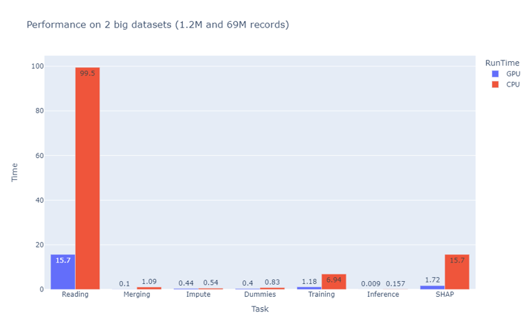
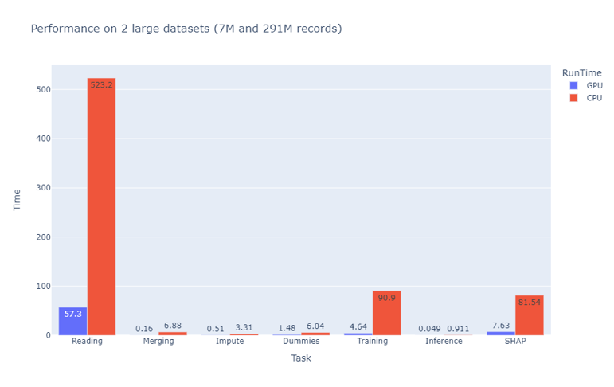

# Credit Delinquency Prediction

This accelerator showcases Prediction of Credit Delinquency with Explainability and GPU acceleration using Nvidia Rapids. Fannie Mae's [single family loan performance dataset](https://capitalmarkets.fanniemae.com/credit-risk-transfer/single-family-credit-risk-transfer/fannie-mae-single-family-loan-performance-data) data is used to train and predict if a customer is going to be delinquent on mortgage payment. The dataset can be configured for any huge structured dataset. Most of the preprocessing and model building tasks are performed by NumPy, Pandas and Scikit-Learn.
* Predict if a customer will be delinquent on mortgage payment.
* Uses GPU acceleration to significantly reduce the processing time on a structured dataset with millions of records.
* [SHAP](https://github.com/slundberg/shap) to explain the predictions.

## Table of Contents
- [Introduction](#introduction)
- [Benchmark](#benchmark)
- [Getting Started](#getting-started)
- [Prerequisites](#prerequisites)
- [Deploy Infrastructure](#deploy-infrastructure)
- [Code Structure](#code-structure)
- [Modeling](#modeling)
- [Acknowledgements](#acknowledgements)
- [Contributing](#contributing)
- [Trademarks](#trademarks)

## Introduction 

Credit delinquency is a serious problem for lenders, as it can lead to losses, lower profitability, and damaged reputation. According to the Federal Reserve, the delinquency rate on consumer loans in the US was 2.54% in the fourth quarter of 2020, which translates to billions of dollars of unpaid debt. To avoid this, lenders need to accurately assess the creditworthiness of borrowers and monitor their repayment behavior.
However, traditional methods of credit scoring and risk management are often based on static and limited data, such as credit history, income, and debt-to-income ratio. These factors may not capture the dynamic and complex nature of borrowers' financial situations, especially in times of uncertainty and crisis. Moreover, some of these methods rely on black-box models that do not provide clear and transparent explanations for their decisions, which can lead to unfair and biased outcomes.
This model leverages the power of predictive analytics and explainable AI to analyze Fannie Mae. By doing so, it can generate more accurate and personalized risk scores and explanations for each borrower, helping lenders make better and more informed decisions.


## Benchmark

We benchmarked how the [Rapids](https://github.com/rapidsai) suite of libraries with GPU acceleration compares to a CPU compute for a typical data science workflow on large datasets. It is observed that the GPU-accelerated workflow is 6-10x faster than the CPU-based workflow depending on the size of the dataset. Bigger the dataset, more the speedup. This was achieved with a few changes in import statements.

The following tables shows the comparison of the two workflows.


The speedup is even more significant for a larger dataset.


It can be noted that the total cost of compute is actually lower by almost half!

## Getting Started

To get started with this project, follow these steps:
1. Clone the repository to Azure ML workspace or your local machine.
2. Create the environment. Dockerfile can be found [here](configuration/environment/docker/Dockerfile).
3. Download the data by running [download_data](download_data.ipynb).
4. [Train](cudf_credit_risk.ipynb) the model leveraging gpu acceleration.

## Prerequisites

- Access to an Azure subscription
- Access to an Azure ML workspace

## Deploy Infrastructure

A guide to deploy the infrastructure for this project can be found [here](.azureDevOps/Deploy-Infrastructure.md).

## Code Structure
```
├── src/
│   ├── crs_main.py
│   ├── data_preparation/
│   │   └── data_preparation.py
│   ├── performance_and_metrics/
│   │   └── performance_and_metrics.py
├── download_data.ipynb
└── cudf_credit_risk.ipynb
```
The source code resides in the [src](src/) directory. [crs_main](src/crs_main.py) is the main file which connects all the components. 
1. First of all, create the environment in the Azure ML workspace using the [docker file](configuration/environment/docker/Dockerfile). You may name it `credit-risk` as used in the [cudf_credit_risk.ipynb](cudf_credit_risk.ipynb) file.
2. Data has to be downloaded by running the [download_data.ipynb](download_data.ipynb) file. It would download and extract the acquisition and performance files and then uploads these to the default datastore required for running the demo.
3. Data Preparation is specific to this demo and is contained in the [data_preparation](src/data_preparation/data_preparation.py) file. It would read the acquisition and performance raw files related to credit risk and then do the feature engineering including the creation of the target column and implement the imputation logic. You are also welcome to implement your own imputation logic by extending the abstract [Imputation](src/imputation/imputation.py) class.
4. The metrics for evaluating a binary classification model and the utility methods for explaining predictions can be found in [performance_and_metrics](src/performance_and_metrics/performance_and_metrics.py).

[cudf_credit_risk.ipynb](cudf_credit_risk.ipynb) is the central file that would provision the compute, connect the default datastore where the data is already downloaded to the run, load the already created environment and then run the experiment. It would also load the files related to performance, metrics and explainability.

## Modeling

The model consists of two main components: a predictive component and an explainable component. The predictive component uses classic ML model to learn from a large dataset of borrowers' features and labels. The features include Financial information, such as income, expenses, assets, liabilities, and credit history. The labels indicate whether the borrower has defaulted or not on a loan within a given time period. The model learns to identify the patterns and relationships between the features and the labels, and then uses them to predict the probability of delinquency for new borrowers.

The explainable component uses a technique called SHAP (SHapley Additive exPlanations) to generate explanations for the predictions of the predictive component. SHAP is a game-theoretic approach that assigns a value to each feature based on how much it contributes to the prediction. The higher the value, the more important the feature is for the prediction. The lower the value, the less important the feature is for the prediction. The sum of all the values equals the prediction. SHAP also provides a graphical representation of the explanations, showing the positive and negative effects of each feature on the prediction.

XGBoost is the machine learning model used for training since it supports GPU-accelerated histogram-based algorithm for constructing decision trees during training. This significantly speeds up the training process for large datasets. However, it may not always be faster than the CPU-based algorithm for smaller datasets. 
However, you are encouraged to add your ML algorithm by creating a class similar to [XGBClassificationModel](src/model/classsification_model.py). It would require you to add methods for training and predictions.

Benefits of the model
The model offers several benefits for lenders and borrowers, such as:
•	Improved accuracy: The model can capture the nuances and dynamics of borrowers' risk and behavior, leading to more accurate and reliable predictions of delinquency.
•	Increased transparency: The model can provide clear and intuitive explanations for its predictions, showing the impact of each feature on the risk score. This can help lenders understand the reasons behind the decisions and justify them to the borrowers and regulators.
•	Enhanced fairness: The model can reduce the potential for bias and discrimination, as it uses a diverse and comprehensive set of data sources and provides explanations for its predictions. This can help lenders avoid unfair and unethical practices and ensure compliance with the laws and regulations.
•	Personalized service: The model can tailor the risk assessment and the explanations to each borrower, taking into account their unique characteristics and preferences. This can help lenders offer more customized and relevant products and services to the borrowers and improve their satisfaction and loyalty.

## Acknowledgements

This code has been adapted to Azure from the awesome [Nvidia's repository](https://github.com/NVIDIA/fsi-samples/tree/main/credit_default_risk).

## Contributing

This project welcomes contributions and suggestions.  Most contributions require you to agree to a
Contributor License Agreement (CLA) declaring that you have the right to, and actually do, grant us
the rights to use your contribution. For details, visit https://cla.opensource.microsoft.com.

When you submit a pull request, a CLA bot will automatically determine whether you need to provide
a CLA and decorate the PR appropriately (e.g., status check, comment). Simply follow the instructions
provided by the bot. You will only need to do this once across all repos using our CLA.

This project has adopted the [Microsoft Open Source Code of Conduct](https://opensource.microsoft.com/codeofconduct/).
For more information see the [Code of Conduct FAQ](https://opensource.microsoft.com/codeofconduct/faq/) or
contact [opencode@microsoft.com](mailto:opencode@microsoft.com) with any additional questions or comments.

## Trademarks

This project may contain trademarks or logos for projects, products, or services. Authorized use of Microsoft 
trademarks or logos is subject to and must follow 
[Microsoft's Trademark & Brand Guidelines](https://www.microsoft.com/en-us/legal/intellectualproperty/trademarks/usage/general).
Use of Microsoft trademarks or logos in modified versions of this project must not cause confusion or imply Microsoft sponsorship.
Any use of third-party trademarks or logos are subject to those third-party's policies.
